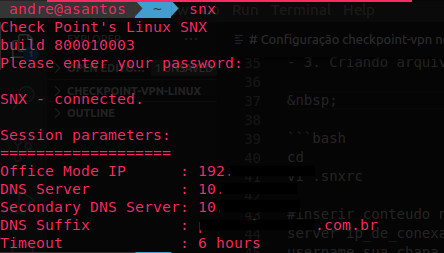

# Configuração checkpoint-vpn no ubuntu

  1. Instalação dependencias:
  - libpam0g:i386 
  - libx11-6:i386 
  - libstdc++6:i386 
  - libstdc++5:i386

&nbsp;

`instalando as dependencias`

  ```bash
sudo apt install libpam0g:i386 libx11-6:i386 libstdc++6:i386 libstdc++5:i386
  ```
&nbsp;

  2. Instalação o SNX:

&nbsp;

```bash
cd Downloads
wget go.ua.pt/sslvpn/SNX/CSHELL/SNX4LINUX30.jar
unzip SNX4LINUX30.jar
chmod +x snx_install.sh
sudo ./snx_install.sh
```
&nbsp;

  3. Criando arquivo de configuração

&nbsp;

```bash
cd
vi .snxrc

#inserir conteudo no arquivo que você criou.
server ip_de_conexao
username seu_usuario
reauth yes
```
`salvar e sair` 

esc :wq!

  4. Conectando via VPN

&nbsp;



&nbsp;

Para desconectar ou conectar na VPN, utilize os comandos abaixo:

```bash
#Connect:
snx

#Disconnect:
snx -d
```

`é isso :)`